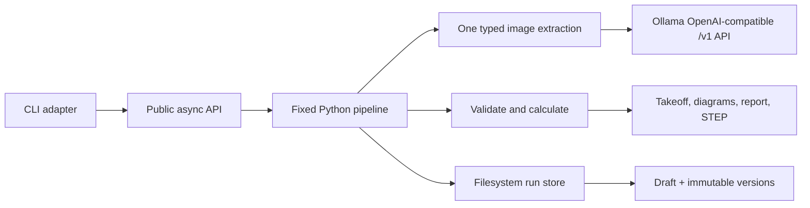

# fab-agent

#### NOTE: I created this repository as an experimental expansion of a simpler prototype I built in another project for a licensed fire protection company.

`fab-agent` turns photographs of simple hand-drawn straight pipe-spool sketches into structured, validated, reviewable fabrication packages.

> **REVIEW OUTPUT — NOT APPROVED FOR FABRICATION**

Completion means that the V1 transcription, deterministic checks, takeoff, and configured review artifacts were generated. It never means that a design is approved or released for fabrication.

## Safety boundary

The language model performs one bounded operation: transcribing an image into typed source
observations. It cannot choose workflow steps, perform arithmetic, normalize dimensions, validate
geometry, author derived values, request arbitrary files or network locations, bypass failures,
or mark a run complete.

Python owns workflow order, clarification selection, exact arithmetic, normalization, validation,
catalog matching, takeoff, diagrams, reports, manifests, CAD generation, and finalization gates.

## V1 scope

One image may contain one or more independent straight spools. V1 supports:

- a straight main pipe along X;
- nominal pipe size, schedule, and required material;
- stated totals and ordered segment chains;
- absolute or chain-derived feature positions;
- perpendicular threaded or grooved outlets;
- explicit up/right/down/left orientation or a sketch legend;
- couplings, caps, open ends, notes, and observed parts lists;
- deterministic reconciliation of stated totals and observed component quantities.

V1 deliberately excludes elbows, arbitrary 3D routing, reducers, exact threads, weld preparation,
flange patterns, code compliance, job-system lookup, databases, queues, inbound HTTP or email
adapters, end-user authentication, and fabrication release. Provider authentication for Ollama
Cloud is confined to the model adapter.

## Architecture



The important package boundaries are:

- `fab_agent.api`: trigger-neutral `run_fab_agent` and `resume_fab_agent` entry points;
- `fab_agent.domain`: exact dimensions, source schemas, validation, and takeoff;
- `fab_agent.application`: fixed pipeline and deterministic clarification policy;
- `fab_agent.ports`: model and storage protocols future adapters can replace;
- `fab_agent.infrastructure`: Ollama, image, catalog, filesystem, and artifact implementations;
- `fab_agent.adapters.cli`: presentation and process-exit behavior only.

## Install

Python 3.12 and [`uv`](https://docs.astral.sh/uv/) are required.

```bash
uv sync
cp config.example.toml config.toml
```

HEIC is optional:

```bash
uv sync --extra heic
```

CadQuery is a normal dependency because STEP generation is enabled by default. It is isolated from the domain and is never the source of engineering truth.

## Configure model inference

`fab-agent` supports Ollama Cloud directly and a local Ollama installation. Both use Ollama's
OpenAI-compatible `/v1` API through the project's existing `httpx` dependency.

### Direct Ollama Cloud (recommended)

Direct cloud mode does not require a local Ollama installation, daemon, sign-in, or model
pull. Create an Ollama API key, keep it in the environment, and use model names returned by
the cloud `/v1/models` endpoint. Do not put the key in `config.toml`.

```bash
export OLLAMA_API_KEY="your-api-key"
cp config.example.toml config.toml
uv run fab-agent doctor
```

The included example is cloud-first:

```toml
[ollama]
connection = "cloud"
api_key_env = "OLLAMA_API_KEY"
vision_model = "qwen3.5:397b"
request_timeout_seconds = 180

[workflow]
max_human_questions = 1
structured_output_retry_count = 2
```

`connection = "cloud"` defaults to `https://ollama.com`. `api_key_env` contains the name of
the environment variable, never the credential itself. The client adds the bearer token only
to cloud requests and never includes it in diagnostics, configuration serialization, or run
artifacts. See Ollama's [cloud guide](https://docs.ollama.com/cloud) and
[authentication guide](https://docs.ollama.com/api/authentication).

Cloud API model names do not necessarily use the local proxy's `-cloud` suffix. `doctor`
queries the authenticated `/v1/models` endpoint and reports whether the configured vision model
is available.

### Local Ollama or the local-to-cloud proxy

Use local mode when model weights run on your machine:

```toml
[ollama]
connection = "local"
base_url = "http://localhost:11434"
vision_model = "YOUR_VISION_MODEL"
request_timeout_seconds = 180
```

Local Ollama can also proxy a cloud model after `ollama signin`. In that arrangement,
`fab-agent` still connects to localhost and uses a model tag such as
`qwen3.5:397b-cloud`. Running the cloud tag once registers it with the local Ollama service; it
does not download the hosted model weights.

```bash
ollama signin
ollama run qwen3.5:397b-cloud
```

The direct cloud configuration is simpler for a cloud-only deployment. The localhost proxy
remains useful when other local tools already share Ollama's model registry and sign-in.

In either mode, the client runs one image-extraction phase using OpenAI-compatible image content.
The configured vision model must call one schema-backed `submit_structured_response` function.
This is structured extraction, not workflow decisioning. Python then runs the fixed sequence:
record observations, validate, request
one allowlisted clarification if needed, compute takeoff, generate outputs, and finalize. No text
or orchestration model is configured or called. Extraction has a hard wall-clock limit in addition
to HTTP transport timeouts. See Ollama's
[OpenAI compatibility](https://docs.ollama.com/api/openai-compatibility) and
[structured-output documentation](https://docs.ollama.com/capabilities/structured-outputs).

The model-facing pipe-spool schema is intentionally flatter than the persisted domain schema.
The vision model returns physical features and dimension strings in left-to-right order. Python
assigns feature IDs, creates segment links, and checks that the number of dimensions matches the
number of physical intervals. Dimension ticks are never domain features, and generic words such as
`pipe`, `unknown`, or `not shown` are not accepted as material.

Nested Pydantic schema references are inlined before they are sent to a model because cloud
models do not consistently follow local `$ref` pointers in function parameters. Invalid extraction
arguments receive at most two correction attempts with concise validation feedback; they are
never broadly pruned or coerced. Compatibility normalization is limited to a string-valued,
non-engineering root `type` discriminator, singleton objects returned for the declared `spools`
or `observed_components` array fields, and JSON strings nested in those same two array fields.
The adapter records each normalization in the observation uncertainties. Every undeclared field
remains a hard validation error. During long cloud calls, the CLI prints a heartbeat every 15
seconds so an active request is visible.

After schema validation, deterministic conversion may make two source-preserving structural
repairs: an `unknown_end` in the first or last ordered position becomes the topological `start` or
`end`, and a missing observed-component kind may be recovered from an explicit parts-list word
such as `coupling`. Both repairs are recorded as uncertainties; labels and raw descriptions remain
unchanged. The stated-total parser accepts the field label `Total` before or after an otherwise
valid imperial dimension, but the general dimension parser remains strict.

Supported overrides are:

- `FAB_AGENT_CONFIG`
- `FAB_AGENT_OLLAMA_CONNECTION`
- `OLLAMA_BASE_URL`
- `FAB_AGENT_OLLAMA_API_KEY_ENV`
- `FAB_AGENT_VISION_MODEL`
- `FAB_AGENT_OUTPUT_ROOT`
- `FAB_AGENT_CATALOG_ROOT`

`--config` selects the configuration file. Supported environment variables override values in
that file, which override application defaults. `--demo` affects only the current run's catalog
policy. Relative output and catalog paths resolve from the configuration file's directory.

Run diagnostics before processing an image:

```bash
uv run fab-agent doctor
```

`doctor` checks configuration, output writability, catalogs, CadQuery, the selected Ollama
endpoint, authentication, and configured vision model. It never downloads models. It
exits `1` when the runtime is configured but not ready and `2` for configuration or execution
errors. It is a health check: it does not run inference, inspect an image, or prove that a model
will follow a tool schema.

## CLI workflow

```bash
uv run fab-agent run fixtures/sample-sketch-2.png
uv run fab-agent run fixtures/sample-sketch-2.png --design-type pipe_spool
uv run fab-agent show RUN_ID
uv run fab-agent resume RUN_ID --answer "carbon steel"
uv run fab-agent rebuild RUN_ID
```

Use `--json` on commands for stable machine-readable output. `awaiting_input` and `needs_review` are valid workflow results and do not produce a failing process exit. Configuration and execution failures do.

On the normal path, `run` makes one vision-model request. A malformed schema response may receive
the configured correction retries, but the entire extraction phase shares one hard wall-clock
limit and the image is never reinspected by an orchestrator. If the run returns `awaiting_input`,
`resume` records the answer and reruns only deterministic Python validation and output generation;
it never calls Ollama. `rebuild` is also model-free.

The repository catalogs contain synthetic geometry only. To exercise them explicitly:

```bash
uv run fab-agent run fixtures/sample-sketch-3.jpg --demo
```

Demo mode is persisted with the run, survives resume, and marks its report as synthetic. A normal run cannot silently use `demo_only` data.

If `resume` is called without `--answer` or `--answer-file`, the CLI prompts interactively. Only the exact allowlisted field named by the pending question can be changed by the answer.

### End-to-end smoke test

```bash
uv run fab-agent doctor
uv run fab-agent run fixtures/sample-sketch-3.jpg --demo
```

The normal path performs one request to the configured vision model and then finishes its Python
steps immediately. Cloud
heartbeats appear every 15 seconds, and the whole extraction phase stops at
`request_timeout_seconds` even when Ollama keeps a connection active. If material is the only
missing required field, continue with the returned run ID:

```bash
uv run fab-agent resume RUN_ID --answer "demo carbon steel"
uv run fab-agent show RUN_ID
```

The exact answer above is the synthetic material in the included demo catalog; it is not a real
fabrication default. Resume should print no cloud heartbeat because it makes no model request. If
the run instead reports `needs_review`, inspect `versions/001/validation.toml`; rerunning the same
image is not the recommended recovery path.

To exercise the complete pipeline deterministically without Ollama:

```bash
uv run pytest tests/test_pipeline_integration.py -v
```

### Four-fixture live walkthrough

Run this from the repository root in a terminal where `OLLAMA_API_KEY` is exported. Each `run`
performs a new cloud transcription, so keep the returned run ID from every command:

```bash
uv run fab-agent doctor

uv run fab-agent run fixtures/sample-sketch-1.jpg --demo
uv run fab-agent run fixtures/sample-sketch-2.png --demo
uv run fab-agent run fixtures/sample-sketch-3.jpg --demo
uv run fab-agent run fixtures/sample-sketch-4.jpg --demo
```

For each run:

1. If it returns `awaiting_input`, answer the exact printed question with `fab-agent resume RUN_ID
   --answer "..."`. `demo carbon steel` is a synthetic test material for the included 2-inch and
   4-inch demo catalog entries. `A135 black steel` is also available for the 4-inch Schedule 10
   sample-quote case. Neither is a fabrication default.
2. Run `uv run fab-agent show RUN_ID` and inspect `draft/design.toml` against the source image.
3. For a completed run, open `review.md`, `bom.csv`, the PNG/SVG diagram, and the STEP file. Confirm
   that every item is still labeled review-only.
4. Treat `needs_review` as a successful safety outcome when the source is conflicting or the model
   transcription is incomplete. Do not keep rerunning an image until a model happens to pass;
   correct `draft/design.toml` and use `fab-agent rebuild RUN_ID` when the source is clear.

The fixtures intentionally exercise different paths:

- `sample-sketch-1.jpg`: multiple spools and a stated-total conflict;
- `sample-sketch-2.png`: a total derived from an ordered segment chain;
- `sample-sketch-3.jpg`: mixed outlet sizes and an orientation legend;
- `sample-sketch-4.jpg`: one threaded outlet, a matching two-segment total, and two loose couplings
  that belong in the BOM without invented CAD placement.

Live success means the command terminates within the configured timeout, preserves a reviewable
transcription, and reaches the appropriate deterministic gate. It does not require every sketch
to reach `complete` and never means approved for fabrication.

## Run storage

```text
runs/<run-id>/
├── run.toml
├── current.toml
├── events.jsonl
├── input/
│   ├── original.<detected-extension>
│   └── normalized.jpg
├── draft/
│   ├── design.toml
│   └── provenance.toml
└── versions/
    ├── 001/
    │   ├── design.toml
    │   ├── provenance.toml
    │   ├── status.toml
    │   ├── validation.toml
    │   ├── takeoff.toml
    │   ├── changes.toml
    │   ├── derived.toml
    │   ├── manifest.toml
    │   └── artifacts/
    └── 002/
```

`draft/` is the human-editable source state. A terminal invocation atomically commits a new immutable application snapshot. `changes.toml` records scalar field differences, `derived.toml` names the deterministic functions used, and `manifest.toml` records artifact paths and SHA-256 hashes. No machine-specific absolute paths are persisted.

To correct a transcription manually, edit `draft/design.toml`, then run:

```bash
uv run fab-agent rebuild RUN_ID
```

Rebuild performs no model call. It records manual-edit provenance, revalidates from scratch, and creates a new version.

## Artifacts

A passing multi-spool package contains:

```text
artifacts/
├── spools/
│   ├── spool-001.step  # Autodesk Fusion-compatible solid
│   ├── spool-001.png
│   ├── spool-001.svg
│   └── ...
├── bom.csv
└── review.md
```

STEP output is simplified review geometry built only from validated source fields and configured catalog geometry. It contains no exact threads, welds, fitting allowances, or standards-based values not present in reviewed catalogs.

### Autodesk Fusion

The generated `.step` file is the Fusion-compatible CAD artifact. In Fusion, use **File > Open >
Open from my computer**, or upload the file through the Data Panel. Fusion translates STEP into
solid bodies that can be inspected and edited. See Autodesk's
[supported file formats](https://help.autodesk.com/view/fusion360/ENU/?guid=TPD-SUPPORTED-FILE-FORMATS)
and [file-opening instructions](https://help.autodesk.com/view/fusion360/ENU/?caas=caas%2Fsfdcarticles%2Fsfdcarticles%2FHow-to-import-or-open-a-file-in-Autodesk-Fusion-360.html).

The application does not generate a native `.f3d` archive. Creating one requires Fusion's own
runtime/API, and converting this simplified review solid would not create a meaningful parametric
timeline. Autodesk identifies F3D as the native format that preserves Fusion timeline information;
STEP is the cleaner headless interchange format for this application.

`bom.csv` distinguishes `derived_geometry`, `observed_parts_list`, and
`observed_and_derived` sources. A loose component written in the sketch's parts list remains in
the BOM even when its placement is not drawn; the application does not invent a CAD position for
it. A quantity conflict is raised only when the same typed component is both modeled and listed
with different quantities. Component keys include nominal size when it is available, so unlike
sizes are never merged into one takeoff line.

## Public API

Future HTTP, queue, email, or application adapters should call the same API as the CLI:

```python
result = await run_fab_agent(request, dependencies)
result = await resume_fab_agent(run_id, human_answer, dependencies)
```

`Dependencies` contains the configuration plus implementations of the small model and run-store ports. Adapter-specific delivery stays outside the application and domain packages.

## Future inputs and design types

Input transport and design semantics are separate extension points. A future image, PDF, form,
email, or queue adapter should normalize its source and call the same public API. A future design
type should provide its own typed observation schema plus deterministic validation, takeoff, and
artifact handler. The application selects a registered handler before extraction; the model does
not invent or orchestrate a new workflow. The registry currently contains only `pipe_spool` and
fails closed for every unknown `--design-type`.

```text
input adapter -> registered design handler -> one typed extraction -> fixed Python pipeline
```

V1 implements only the straight pipe-spool handler. Unsupported design types must stop for review
until a tested handler is added. An optional intake agent may later classify ambiguous,
multi-document packages, but it remains outside the fabrication-authority boundary.

## Tests and quality checks

Normal tests do not require Ollama:

```bash
uv run pytest
uv run pytest --cov=fab_agent --cov-report=term-missing
uv run ruff format --check .
uv run ruff check .
uv run mypy src
```

The test suite covers exact arithmetic, validation, takeoff, TOML persistence, safe image
normalization, immutable versions, provenance, malformed structured responses, the one-call
pipeline, deterministic clarification and resume, Ollama retry behavior, diagrams, and actual
CadQuery STEP export.

The four supplied photographs are repeatable image-normalization and manual live-test fixtures:

- `sample-sketch-1.jpg`: multiple spools and a stated-total conflict;
- `sample-sketch-2.png`: total derived from an ordered segment chain;
- `sample-sketch-3.jpg`: mixed outlet sizes and an orientation legend;
- `sample-sketch-4.jpg`: one threaded outlet with a matching two-segment total.

The committed fixture files retain their visible source pixels and color profiles but have camera,
location, timestamp, device, editor-path, and other ancillary metadata removed.

Live model transcription is intentionally optional and nondeterministic. A configured direct
cloud endpoint or local Ollama service is required only for real `run` invocations. `resume` and
`rebuild` do not call a model. The opt-in test below is a live endpoint and model-availability health check, not
an image-transcription acceptance test.

To include the live health check explicitly:

```bash
FAB_AGENT_RUN_LIVE_OLLAMA=1 uv run pytest -m live_ollama
```

## Known limitations

- Handwriting interpretation depends on the configured vision model.
- Ollama Cloud does not enforce the full image-transcription schema; model-authored function
  arguments are always validated locally and schema mismatches end in `needs_review`, except for
  the explicitly recorded structural compatibility normalizations described above.
- Material must be observed, supplied by a human, or manually entered. Schedule and component codes never imply material.
- Only one focused human clarification is allowed per run.
- The filesystem store assumes one writer per run and enforces this with a per-run lock.
- Real fabrication work requires reviewed organization-specific pipe and component catalogs.
- A package remains review-only even when its run status is `complete`.
